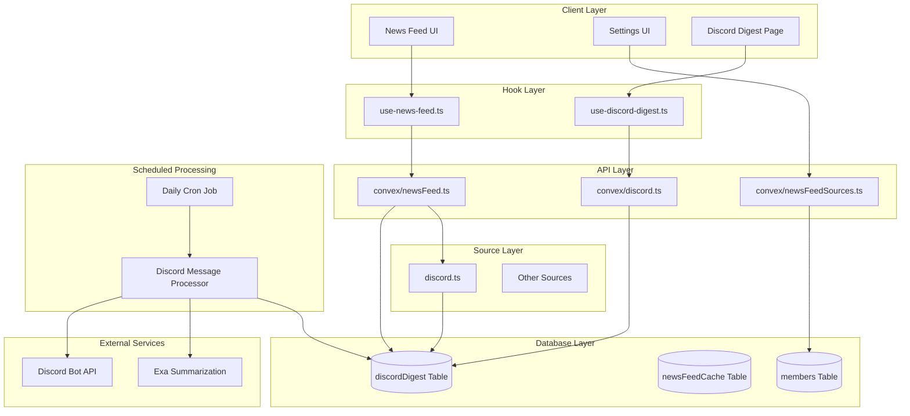

# Design Document

## Overview

The Discord Daily Digest Integration extends the existing Phase 0 news feed infrastructure to include Discord messages from the VAI Discord server. The system uses an archive-based approach where a scheduled process collects, processes, and stores yesterday's Discord messages in the database. Users then read from this pre-processed archive rather than fetching live data from Discord. This design provides better performance, reliability, and user experience while leveraging the established modular source system and user preference management.

## Architecture

### High-Level Architecture



### Integration with Existing Architecture

The archive-based design builds upon the established Phase 0 infrastructure:

- **Modular Source System**: Discord becomes a new source type in `features/news/utils/news-sources/`
- **Database Storage**: New `discordDigest` table stores processed messages alongside existing tables
- **Scheduled Processing**: Uses Convex cron jobs for daily message collection and processing
- **User Preferences**: Extends existing news preferences system in member schema
- **NewsItem Interface**: Discord messages conform to existing `NewsItem` structure
- **Error Handling**: Follows established patterns for graceful degradation

### Archive-Based Processing Flow

1. **Daily Collection**: Cron job runs at 6 AM UTC to collect previous day's messages
2. **Processing Pipeline**: Messages are ranked, summarized, and transformed
3. **Database Storage**: Processed messages stored in `discordDigest` table
4. **User Consumption**: Users read from pre-processed archive, not live Discord API

## Components and Interfaces

### Core Components

#### 1. Discord Archive Schema (`convex/schema.ts`)

```typescript
// New table for storing processed Discord messages
discordDigest: defineTable({
  messageId: v.string(), // Discord message ID
  content: v.string(),
  author: v.object({
    id: v.string(),
    username: v.string(),
    avatar: v.optional(v.string()),
  }),
  timestamp: v.number(), // Unix timestamp
  reactions: v.array(v.object({
    emoji: v.string(),
    count: v.number(),
  })),
  channelId: v.string(),
  channelName: v.string(),
  reactionScore: v.number(), // Pre-calculated for sorting
  summary: v.optional(v.string()), // AI-generated summary
  digestDate: v.string(), // YYYY-MM-DD format for the digest day
  processedAt: v.number(), // When this was processed
})
.index("by_digest_date", ["digestDate"])
.index("by_reaction_score", ["digestDate", "reactionScore"])
.index("by_message_id", ["messageId"]);
```

#### 2. Discord Source Module (`features/news/utils/news-sources/discord.ts`)

```typescript
export interface DiscordSourceConfig extends NewsSource {
  type: "discord";
  guildId: string;
  channels?: string[]; // Optional channel filtering
}

// Reads from database archive instead of live Discord API
export async function fetchItems(source: DiscordSourceConfig): Promise<RawItem[]> {
  // Fetch from discordDigest table, not Discord API
  const digestEntries = await ctx.db
    .query("discordDigest")
    .withIndex("by_digest_date", (q) => q.eq("digestDate", getYesterdayDate()))
    .order("desc")
    .take(50);
    
  return digestEntries.map(transformDigestToRawItem);
}
```

#### 3. Discord Processing & Archive API (`convex/discord.ts`)

```typescript
// Scheduled action to collect and process Discord messages
export const processDiscordDigest = action({
  args: {
    targetDate: v.string(), // YYYY-MM-DD format
  },
  handler: async (ctx, args) => {
    // 1. Fetch messages from Discord API for target date
    const messages = await fetchDiscordMessagesFromAPI(args.targetDate);
    
    // 2. Process and rank messages
    const processedMessages = await processMessages(messages);
    
    // 3. Store in discordDigest table
    await storeProcessedMessages(ctx, processedMessages, args.targetDate);
  }
});

// Query to get archived Discord digest for users
export const getDiscordDigest = query({
  args: {
    digestDate: v.optional(v.string()), // Defaults to yesterday
    limit: v.optional(v.number()),
    userId: v.optional(v.id("members")),
  },
  handler: async (ctx, args) => {
    const targetDate = args.digestDate || getYesterdayDateString();
    
    return await ctx.db
      .query("discordDigest")
      .withIndex("by_reaction_score", (q) => 
        q.eq("digestDate", targetDate)
      )
      .order("desc")
      .take(args.limit || 50);
  }
});

// Internal helper to fetch from Discord API
async function fetchDiscordMessagesFromAPI(targetDate: string): Promise<DiscordMessage[]> {
  // Discord API integration logic
}

// Internal helper to process and rank messages
async function processMessages(messages: DiscordMessage[]): Promise<ProcessedDiscordMessage[]> {
  // Ranking, summarization, and processing logic
}
```

#### 4. Scheduled Processing (`convex/crons.ts`)

```typescript
// Daily cron job to process Discord messages
export const processDiscordDigest = cron(
  "process discord digest",
  "0 6 * * *", // 6 AM UTC daily
  internal.discord.processDiscordDigest,
  { targetDate: getYesterdayDateString() }
);
```

#### 5. User Preferences Storage (`convex/newsFeedSources.ts`)

```typescript
export const updateDiscordPreferences = mutation({
  args: {
    userId: v.id("members"),
    enabled: v.boolean(),
    channels: v.optional(v.array(v.string())),
  },
  handler: async (ctx, args)
});

export const getDiscordPreferences = query({
  args: {
    userId: v.id("members"),
  },
  handler: async (ctx, args)
});
```

#### 4. Settings UI Components

- `app/settings/news-sources/page.tsx` - Main settings page
- `components/news/news-source-form.tsx` - Reusable form component
- `components/news/discord-settings.tsx` - Discord-specific settings

#### 5. Discord Digest Hook (`hooks/use-discord-digest.ts`)

```typescript
export function useDiscordDigest() {
  const [messages, setMessages] = useState<NewsItem[]>([]);
  const [loading, setLoading] = useState(true);
  const [error, setError] = useState<string | null>(null);
  
  const refresh = useCallback(async () => {
    // Fetch Discord-only content
  }, []);
  
  return { messages, loading, error, refresh };
}
```

### Extended Interfaces

#### Updated NewsSource Type

```typescript
export type SourceType = "rss" | "youtube" | "podcast" | "blog" | "x" | "website" | "discord";

export interface DiscordNewsSource extends NewsSource {
  type: "discord";
  guildId: string;
  channels?: string[];
}
```

#### Enhanced Member Schema

```typescript
// Extension to existing newsPreferences in members table
newsPreferences: v.optional(v.object({
  enabledCategories: v.array(v.string()),
  customSources: v.array(v.object({
    type: v.union(
      v.literal("repository"),
      v.literal("website"),
      v.literal("discord") // New type
    ),
    url: v.string(),
    name: v.string(),
    // Discord-specific config
    guildId: v.optional(v.string()),
    channels: v.optional(v.array(v.string())),
  })),
  refreshInterval: v.number(),
  discordEnabled: v.optional(v.boolean()), // Quick toggle
}))
```

## Data Models

### Archive-Based Processing Flow

1. **Daily Collection**: Cron job fetches raw Discord messages from API
2. **Processing Pipeline**: Messages are ranked, summarized, and deduplicated
3. **Database Storage**: Processed messages stored in `discordDigest` table
4. **User Consumption**: Frontend reads from database archive, not Discord API

### Database Schema Design

The `discordDigest` table serves as the central archive with optimized indexes:

- **Primary Storage**: All processed Discord messages with metadata
- **Indexing Strategy**: Optimized for date-based queries and reaction ranking
- **Data Retention**: Messages stored indefinitely for historical access
- **Deduplication**: Unique constraint on `messageId` prevents duplicates

### Message Ranking Algorithm

```typescript
function rankDiscordMessages(messages: DiscordMessage[]): DiscordMessage[] {
  return messages.sort((a, b) => {
    const aReactions = a.reactions.reduce((sum, r) => sum + r.count, 0);
    const bReactions = b.reactions.reduce((sum, r) => sum + r.count, 0);
    
    // Primary: reaction count (descending)
    if (aReactions !== bReactions) {
      return bReactions - aReactions;
    }
    
    // Secondary: timestamp (newest first)
    return new Date(b.timestamp).getTime() - new Date(a.timestamp).getTime();
  });
}
```

### Data Transformation

```typescript
function transformDiscordToNewsItem(message: DiscordMessage): NewsItem {
  return {
    title: `${message.author.username} in #${message.channelName}`,
    url: `https://discord.com/channels/${GUILD_ID}/${message.channelId}/${message.id}`,
    publishedDate: message.timestamp,
    author: message.author.username,
    summary: await summarizeWithExa(message.content),
    source: "Discord",
    metadata: {
      reactions: message.reactions,
      channelName: message.channelName,
      messageId: message.id,
    }
  };
}
```

## Error Handling

### Graceful Degradation Strategy

1. **Discord API Failures**: Continue serving other news sources
2. **Bot Permission Issues**: Log errors, show user-friendly messages
3. **Rate Limiting**: Implement exponential backoff with jitter
4. **Network Timeouts**: Fallback to cached data when available

### Error Recovery Patterns

```typescript
// Archive-based error handling focuses on processing failures
async function processDiscordDigestWithFallback(targetDate: string): Promise<void> {
  try {
    await processDiscordDigest({ targetDate });
  } catch (error) {
    console.error('Discord digest processing failed:', error);
    
    // Log failure for monitoring
    await logProcessingFailure(targetDate, error);
    
    // Don't throw - let other cron jobs continue
    // Users will see previous day's data or empty state
  }
}

// User-facing queries always succeed with graceful fallback
async function getDiscordDigestWithFallback(digestDate: string): Promise<NewsItem[]> {
  try {
    const digest = await getDiscordDigest({ digestDate });
    return digest || [];
  } catch (error) {
    console.error('Failed to fetch Discord digest:', error);
    return []; // Always return empty array, never throw
  }
}
```

### User-Facing Error Messages

- **Bot Not Configured**: "Discord integration is not available. Please contact support."
- **Permission Denied**: "Unable to access Discord messages. Bot permissions may need updating."
- **Rate Limited**: "Discord data temporarily unavailable. Please try again in a few minutes."
- **Network Error**: "Connection to Discord failed. Showing cached content."

## Testing Strategy

### Unit Tests

1. **Discord Message Fetching** (`lib/__tests__/discord.test.ts`)
   - Mock Discord API responses
   - Test message ranking algorithm
   - Verify data transformation logic
   - Test error handling scenarios

2. **News Feed Integration** (`tests/convex/newsFeed.test.ts`)
   - Test Discord source integration
   - Verify caching behavior
   - Test user preference handling
   - Test fallback mechanisms

### Integration Tests

1. **End-to-End Discord Flow** (`playwright/discord-digest.spec.ts`)
   - Enable Discord in settings
   - Verify messages appear in news feed
   - Test dedicated Discord page
   - Test error states and recovery

2. **Settings Management** (`playwright/news-sources.spec.ts`)
   - Toggle Discord on/off
   - Configure channel preferences
   - Verify preference persistence
   - Test settings UI interactions

### Performance Tests

1. **Load Testing**: Verify Discord integration doesn't impact existing performance
2. **Cache Efficiency**: Test cache hit rates and expiration behavior
3. **Rate Limiting**: Verify proper handling of Discord API limits

### Test Data Setup

```typescript
// Mock Discord API responses for testing
const mockDiscordMessages: DiscordMessage[] = [
  {
    id: "123456789",
    content: "Check out this new AI development!",
    author: { id: "user1", username: "testuser" },
    timestamp: "2025-01-14T10:00:00Z",
    reactions: [{ emoji: "👍", count: 5 }, { emoji: "🔥", count: 3 }],
    channelId: "general",
    channelName: "general"
  }
];
```

## Security Considerations

### Bot Token Management
- Store `DISCORD_BOT_TOKEN` in Convex environment variables
- Never expose bot token in client-side code
- Implement token rotation procedures

### Permission Scoping
- Bot requires minimal permissions: `Read Message History`
- Restrict to specific channels if needed
- Regular permission audits

### Data Privacy
- Don't store Discord message content permanently
- Respect Discord's Terms of Service
- Handle user data according to privacy policy

### Rate Limiting Compliance
- Implement proper rate limiting to respect Discord API limits
- Use exponential backoff for retries
- Monitor API usage and implement alerts

## Performance Optimization

### Caching Strategy
- **L1 Cache**: Browser localStorage (30 minutes)
- **L2 Cache**: Convex `newsFeedCache` table (10 minutes)
- **Invalidation**: Manual refresh or preference changes

### Batch Processing
- Fetch messages in batches to reduce API calls
- Process reactions and ranking server-side
- Minimize client-side computation

### Lazy Loading
- Load Discord digest on-demand for dedicated page
- Progressive enhancement for main news feed
- Optimize bundle size with dynamic imports

## Deployment Considerations

### Environment Setup
```bash
# Required environment variables
DISCORD_BOT_TOKEN=your_bot_token_here
DISCORD_GUILD_ID=1355280592962453585  # Already configured
```

### Bot Configuration
1. Create Discord application and bot
2. Generate bot token
3. Add bot to VAI Discord server
4. Grant necessary permissions
5. Test bot connectivity

### Monitoring and Observability
- Log Discord API response times
- Monitor error rates and types
- Track user engagement with Discord content
- Alert on bot permission issues

### Rollback Strategy
- Feature flags for Discord integration
- Graceful degradation if issues arise
- Quick disable mechanism in settings
- Preserve existing news feed functionality