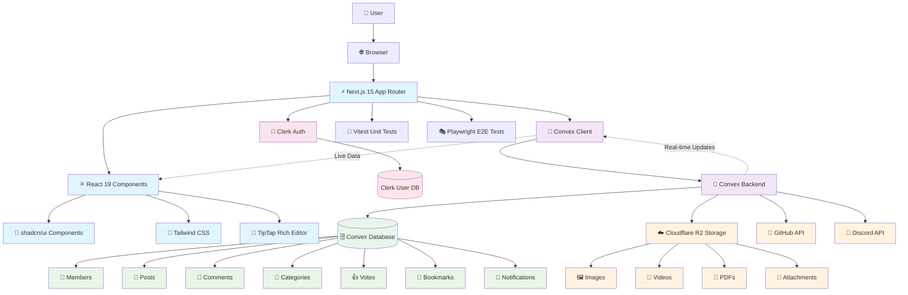
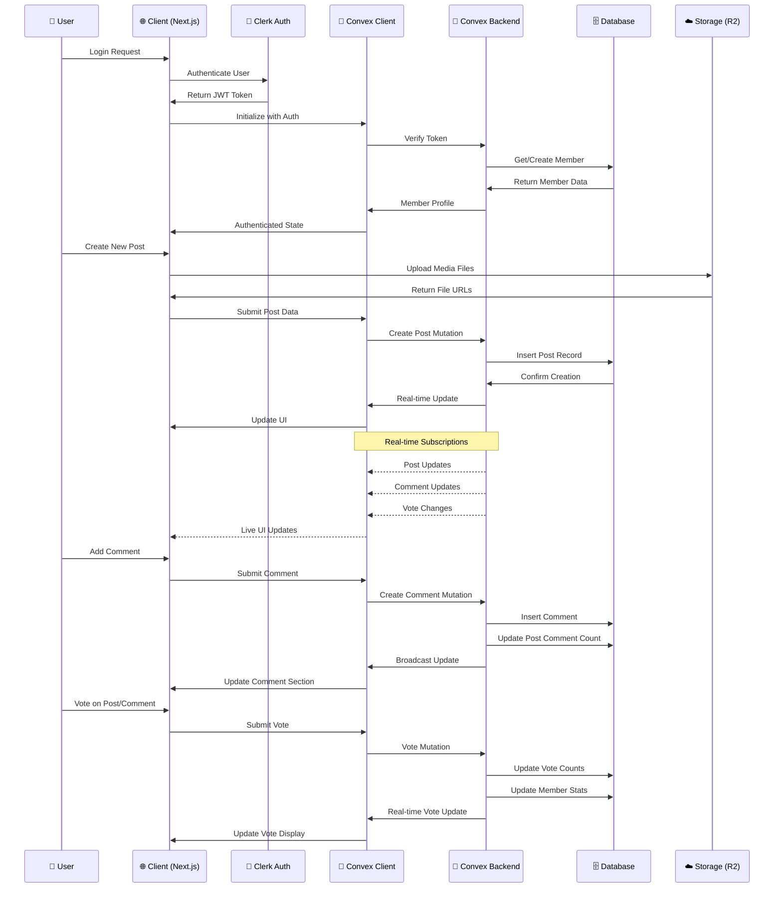

# VAI-VEX: AI Engineers Community Platform

A modern, real-time community platform built for AI engineers to share knowledge, collaborate, and build together. This Next.js application with Convex backend replaces the old-school website with a fun, engaging, and easy-to-contribute platform.

## 🎯 **Project Vision**

**RESULT**: A replacement for the old skool website that makes people enjoy engaging with our community.

**PURPOSE**:
- Understand how Convex works and make the site easy to work on
- Provide a better member experience and become a household name
- Bring AI to the member experience with chatbots that can answer questions from Discord and the website

## 🏗️ **Architecture Overview**

### **System Architecture Diagram**



### **Technology Stack**
- **Frontend**: Next.js 15 + React 19 + TypeScript
- **Backend**: Convex (real-time database + serverless functions)
- **Authentication**: Clerk
- **UI Framework**: Tailwind CSS + shadcn/ui components
- **Rich Text**: TipTap editor
- **Testing**: Vitest + Playwright

### **Project Structure**
```
vai-vex/
├── app/                    # Next.js App Router (main application)
│   ├── layout.tsx         # Root layout with providers
│   ├── page.tsx           # Homepage (post feed)
│   ├── members/           # Member directory & profiles  
│   ├── create/            # Post creation
│   └── api/               # API routes (Discord, GitHub integration)
├── components/             # React components
│   ├── ui/                # shadcn/ui components
│   ├── header.tsx         # Global navigation
│   ├── post-list.tsx      # Post feed component
│   └── ...                # Feature components
├── convex/                 # Backend logic & database
│   ├── schema.ts          # Database schema
│   ├── posts.ts           # Post CRUD operations
│   ├── members.ts         # User management
│   ├── auth.ts            # Authentication helpers
│   └── ...                # Other backend modules
├── lib/                    # Utility functions & helpers
├── hooks/                  # Custom React hooks
└── types/                  # TypeScript type definitions
```

### **Component Architecture Flow**

```mermaid
graph TD
    %% App Router Structure
    AppLayout[📱 app/layout.tsx<br/>Root Layout] --> Header[🧭 Header Component]
    AppLayout --> ThemeProvider[🎨 Theme Provider]
    AppLayout --> ClerkProvider[🔐 Clerk Provider]
    AppLayout --> ConvexProvider[📡 Convex Provider]

    %% Main Pages
    AppLayout --> HomePage[🏠 app/page.tsx<br/>Homepage]
    AppLayout --> MembersPage[👥 app/members/page.tsx]
    AppLayout --> CreatePage[✏️ app/create/page.tsx]
    AppLayout --> CategoryPage[📁 app/[category]/page.tsx]

    %% Homepage Components
    HomePage --> PostList[📋 PostList Component]
    PostList --> PostCard[📄 PostCard Component]
    PostCard --> VoteButtons[👍 Vote Buttons]
    PostCard --> BookmarkButton[🔖 Bookmark Button]
    PostCard --> PostPreview[👁️ Post Preview]

    %% Post Detail Flow
    PostCard --> PostDetail[📖 Post Detail Modal]
    PostDetail --> CommentSection[💬 Comment Section]
    CommentSection --> CommentInput[✍️ Enhanced Comment Input]
    CommentSection --> CommentItem[💭 Comment Item]

    %% Create Post Flow
    CreatePage --> PostCreationForm[📝 Post Creation Form]
    PostCreationForm --> RichTextEditor[📝 Rich Text Editor]
    PostCreationForm --> MediaUpload[📎 Media Upload Section]
    PostCreationForm --> CategorySelect[📁 Category Selection]

    %% Member Features
    MembersPage --> MemberCard[👤 Member Card]
    MemberCard --> MemberProfile[📊 Member Profile Modal]

    %% Shared UI Components
    Header --> AuthButton[🔑 Auth Button]
    Header --> ThemeToggle[🌓 Theme Toggle]
    Header --> GlobalSearch[🔍 Global Search]
    Header --> NotificationBell[🔔 Notification Bell]

    %% Real-time Features
    ConvexProvider -.->|Real-time Data| PostList
    ConvexProvider -.->|Live Updates| CommentSection
    ConvexProvider -.->|Instant Sync| VoteButtons

    %% Styling
    classDef page fill:#e3f2fd
    classDef component fill:#f1f8e9
    classDef ui fill:#fce4ec
    classDef realtime fill:#fff3e0

    class AppLayout,HomePage,MembersPage,CreatePage,CategoryPage page
    class PostList,PostCard,PostDetail,CommentSection,PostCreationForm,MemberCard component
    class Header,AuthButton,ThemeToggle,GlobalSearch,VoteButtons,BookmarkButton ui
    class ConvexProvider realtime
```

## 🗄️ **Database Schema**

### **Core Entities**

**Members Table**
- User profiles with Clerk authentication
- Cached statistics (post count, comment count, net votes)
- Rich profile data (bio, links, skills, location)
- Support for legacy email-based and new externalId-based auth

**Posts Table**
- Multiple content types: text, image, video, link
- Reddit-style voting system (upvotes/downvotes)
- Categorization and link preview functionality
- Version history tracking for edits

**Comments Table**
- Nested comment system with depth tracking
- Voting on comments
- Status management (active/deleted/hidden)

**Categories Table**
- Post organization and filtering
- Admin controls and rules

### **Data Flow Architecture**



## 🚀 **Getting Started**

### **Prerequisites**
- Node.js 18+ 
- npm or pnpm

### **Installation**
```bash
# Clone the repository
git clone https://github.com/joinvai/vai-vex.git
cd vai-vex

# Install dependencies
npm install

# Set up Convex backend
npx convex dev

# Configure environment variables
# Add your Clerk keys to .env.local

# Start development servers
npm run dev
```

### **Development Scripts**
```bash
npm run dev              # Start both frontend and backend
npm run dev:frontend     # Start Next.js only
npm run dev:backend      # Start Convex only
npm run build           # Build for production
npm run test            # Run unit tests
npm run test:visual     # Run Playwright tests
npm run lint            # Code quality checks
```

## 🔄 **Key Architectural Patterns**

### **1. Unified Authentication Flow**
- Handles both legacy (email-based) and new (Clerk externalId) authentication
- Automatically migrates legacy users
- Context-aware behavior for queries vs mutations
- Auto-creates user profiles on first login

### **2. Real-time Data with Convex**
- **Queries**: Real-time reactive data fetching
- **Mutations**: Server-side data modifications  
- **Subscriptions**: Automatic UI updates when data changes

### **3. Component Architecture**
- **Atomic Design**: Reusable UI components in `/components/ui/`
- **Feature Components**: Higher-level components like `post-list.tsx`
- **Layout Components**: Consistent structure with `header.tsx`, `footer.tsx`

## 🎨 **UI System**

- **shadcn/ui**: Pre-built, accessible components
- **Tailwind CSS**: Utility-first styling
- **Theme System**: Dark/light mode support
- **Responsive Design**: Mobile-first approach

## 🔍 **Key Features**

### **Content Management**
- Multi-format posts (text, images, videos, links)
- Rich text editing with TipTap
- Automatic link previews
- Content validation and security checks

### **Community Features**
- Reddit-style voting system
- Rich member profiles with statistics
- Full-text search across posts and members
- Category-based content organization

### **Real-time Features**
- Live updates without page refresh
- Real-time voting and comment updates
- Instant search results

## 📋 **Development Status**

### **Completed ✅**
- [x] Database schema and data models
- [x] ShadCN/UI integration
- [x] Basic layout and navigation
- [x] Reddit-style voting system
- [x] Authentication with Clerk
- [x] Real-time post feed

### **In Progress 🔄**
- [ ] Component connections (post-sidebar, post-detail, etc.)
- [ ] Member directory and profiles
- [ ] Search functionality
- [ ] Comment system

### **Planned 📋**
- [ ] Stripe payments integration
- [ ] Discord bot for membership tracking
- [ ] AI chatbot for community Q&A
- [ ] 3D/AI rotating object
- [ ] Automated channel summaries

## 🛠️ **Contributing**

### **Code Style**
- TypeScript for type safety
- ESLint + Prettier for code formatting
- Conventional commits for git history

### **Development Workflow**
1. Create feature branch from `master`
2. Make changes with proper TypeScript types
3. Add tests for new functionality
4. Run linting and tests locally
5. Create pull request with clear description

### **Architecture Guidelines**
- Keep components small and focused
- Use Convex queries/mutations for data operations
- Follow existing patterns for authentication
- Maintain real-time functionality where applicable

## 📚 **Learning Resources**

- [Convex Documentation](https://docs.convex.dev/)
- [Next.js App Router](https://nextjs.org/docs/app)
- [shadcn/ui Components](https://ui.shadcn.com/)
- [Clerk Authentication](https://clerk.com/docs)

## 🤝 **Community**

This platform is built by AI engineers, for AI engineers. We welcome contributions that make the community experience better for everyone.

---

*Built with ❤️ by the VAI community*
