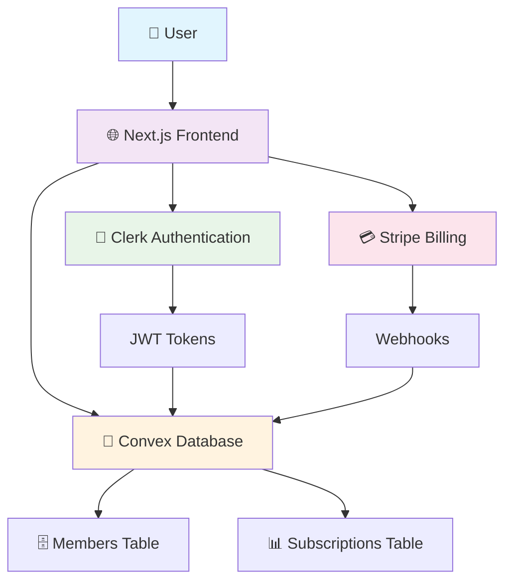
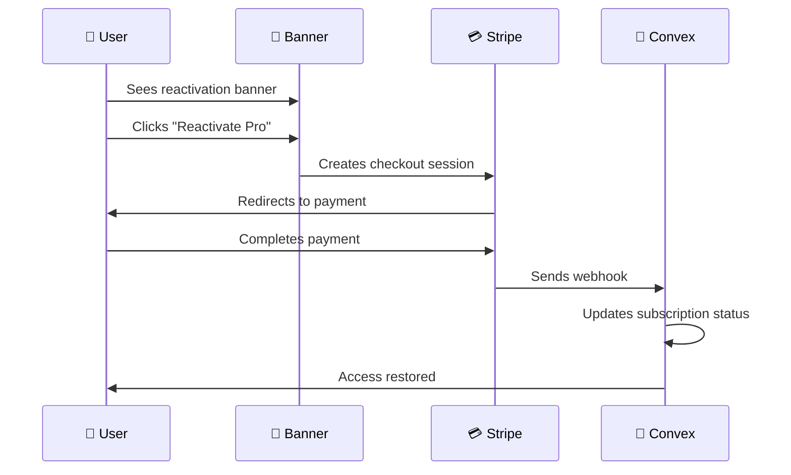

# 🚀 VAI Platform: User Management & Billing Systems Guide

*A comprehensive guide to understanding VAI's sophisticated user management, authentication, and billing architecture*

---

## 📋 Table of Contents

1. [🏗️ Architecture Overview](#architecture-overview)
2. [🔐 Authentication & User Management](#authentication--user-management)
3. [💳 Billing System](#billing-system)
4. [👥 Membership Tiers & Access Control](#membership-tiers--access-control)
5. [🔄 Reactivation System](#reactivation-system)
6. [🛠️ Technical Implementation](#technical-implementation)
7. [📊 Monitoring & Analytics](#monitoring--analytics)

---

## 🏗️ Architecture Overview

VAI operates on a **zero free users** policy with a sophisticated three-way integration:



### Core Principles

- **Zero Free Users**: Every user must have a paid subscription
- **Seamless Authentication**: Clerk handles auth, Convex manages data
- **Grace Period Billing**: Users pay on their joinedDate anniversary
- **Scholarship via Coupons**: No free tier, scholarships use Stripe coupons

---

## 🔐 Authentication & User Management

### The Three-Way Integration

#### 1. **Clerk (Authentication Provider)**
- Handles sign-up, sign-in, and session management
- Generates JWT tokens for secure API access
- Manages user profiles and authentication methods
- Provides social login options (Google, Discord)

#### 2. **Convex (Database & Backend)**
- Stores member profiles and subscription data
- Validates JWT tokens from Clerk
- Manages real-time data synchronization
- Handles business logic and access control

#### 3. **Stripe (Billing & Payments)**
- Processes subscription payments
- Manages customer billing cycles
- Sends webhooks for payment events
- Handles coupon codes for scholarships

### User Account Creation Flows

#### 🛒 **Checkout Flow (Guest → Member)**

```typescript
// When a guest completes Stripe checkout:
1. Stripe webhook triggers → convex/stripe/webhooks.ts
2. Creates member record in database
3. Creates Clerk account via Backend API
4. Generates temporary signInToken (5 minutes)
5. Auto-signs user in on success page
```

**The `signInToken` Field:**
- **Purpose**: One-time authentication token for post-checkout auto-login
- **Lifecycle**: Created after checkout → Used for auto-signin → Expires in 5 minutes
- **Cleanup**: Background job removes expired tokens after 1 hour
- **Why it exists**: Seamless UX - users don't need separate signup after payment

#### 👤 **Normal Signup Flow**

```typescript
// Traditional authentication flow:
1. User clicks "Sign Up" → Clerk handles authentication
2. JWT token generated → Passed to Convex automatically  
3. First authenticated request → getAuthenticatedMember()
4. Creates member record with externalId from JWT
5. No signInToken needed (already authenticated)
```

### Migration Strategy: Legacy → Modern Auth

VAI supports both legacy email-based auth and modern Clerk authentication:

```typescript
// Dual lookup strategy in convex/auth.ts
async function getAuthenticatedMember(ctx) {
  // 1. Try modern lookup by Clerk externalId
  let member = await ctx.db
    .query("members")
    .withIndex("by_externalId", q => q.eq("externalId", clerkUserId))
    .first();
    
  if (member) return member;
  
  // 2. Fallback to legacy email lookup
  member = await ctx.db
    .query("members")
    .filter(q => q.eq("email", email))
    .first();
    
  // 3. Auto-migrate: add externalId to legacy record
  if (member) {
    await ctx.db.patch(member._id, { externalId: clerkUserId });
  }
}
```

---

## 💳 Billing System

### Grace Period Billing Model

VAI uses a unique billing approach where users pay on the same day number as their `joinedDate`:

```typescript
// Example: User joined on March 15th
// They pay on the 15th of every month (or next month if <5 days notice)

function calculateNextBillingDate(joinedDate: number): Date {
  const joined = new Date(joinedDate);
  const dayOfMonth = joined.getDate();
  
  const now = new Date();
  const nextBilling = new Date(now.getFullYear(), now.getMonth(), dayOfMonth);
  
  // If billing date already passed this month, use next month
  if (nextBilling <= now) {
    nextBilling.setMonth(nextBilling.getMonth() + 1);
  }
  
  // Ensure 5-day advance notice
  const daysUntilBilling = Math.ceil(
    (nextBilling.getTime() - now.getTime()) / (1000 * 60 * 60 * 24)
  );
  
  if (daysUntilBilling < 5) {
    nextBilling.setMonth(nextBilling.getMonth() + 1);
  }
  
  return nextBilling;
}
```

### Subscription Lifecycle Management

#### Payment Success Flow
```typescript
// convex/stripe/webhooks.ts - handlePaymentSucceeded()
1. Webhook received from Stripe
2. Update member.subscriptionStatus = "active"
3. Set member.subscriptionEndDate = currentPeriodEnd
4. Update member.lastPaymentDate = now
5. Clear any payment failure records
```

#### Payment Failure Handling
```typescript
// convex/stripe/webhooks.ts - handlePaymentFailed()
1. Webhook received from Stripe  
2. Update member.subscriptionStatus = "past_due"
3. Store failure details in member.lastPaymentFailure
4. Trigger retry logic (automatic via Stripe)
5. Send notification to user
```

#### Retry Logic
```typescript
// convex/stripe/retryFailedPayment.ts
export const retryFailedPayment = action({
  handler: async (ctx, { invoiceId }) => {
    const invoice = await stripe.invoices.retrieve(invoiceId);
    
    if (invoice.status === "open") {
      const result = await stripe.invoices.pay(invoiceId);
      return { success: result.status === "paid" };
    }
    
    return { success: false, requiresNewPaymentMethod: true };
  }
});
```

### Webhook Integration

VAI processes these critical Stripe events:

| Event | Purpose | Handler |
|-------|---------|---------|
| `checkout.session.completed` | New subscription created | Creates member + Clerk account |
| `customer.subscription.updated` | Subscription changes | Updates tier/billing info |
| `invoice.payment_succeeded` | Successful payment | Activates/renews subscription |
| `invoice.payment_failed` | Failed payment | Sets past_due status |
| `customer.subscription.deleted` | Cancellation | Starts grace period |

---

## 👥 Membership Tiers & Access Control

### Current Tier Structure

VAI operates with **zero free users** and three paid tiers:

| Tier | Price | Features | Target Audience |
|------|-------|----------|-----------------|
| 🥇 **Founding Member** | $39/mo or $375/yr | Full access + grandfathered pricing | Early supporters |
| 🐦 **Early Bird** | $50/mo or $480/yr | Full access + early adopter pricing | Beta users |
| 👤 **Member** | $99/mo | Full access at standard pricing | Regular users |

### Scholarship Implementation

**Important**: Scholarships are NOT a separate tier. They use Stripe coupons:

```typescript
// Creating scholarship checkout session
const sessionParams = {
  line_items: [{ price: "early_bird_monthly_price_id", quantity: 1 }],
  discounts: [{ coupon: "SCHOLARSHIP_100_OFF" }], // 100% discount
  metadata: { isScholarship: "true" }
};

// In webhook handler
if (session.metadata?.isScholarship === "true") {
  await ctx.db.patch(memberId, {
    tier: "early_bird", // Scholarship users get early_bird tier
    subscriptionStatus: "active"
  });
}
```

### Access Control Logic

```typescript
// convex/helpers/access.ts
export function canViewFullContent(member: Doc<"members"> | null): boolean {
  if (!member) return false;
  
  // Active subscriptions get immediate access
  if (member.subscriptionStatus === "active") {
    const fullAccessTiers = ["founding_member", "early_bird", "member"];
    return member.tier ? fullAccessTiers.includes(member.tier) : false;
  }
  
  // Grace period for cancelled subscriptions
  if (member.subscriptionStatus === "cancelled" && member.subscriptionEndDate) {
    return member.subscriptionEndDate > Date.now();
  }
  
  // All other statuses deny access
  return false;
}
```

### Zero Free Users Policy

The platform enforces this through:

1. **Database Schema**: No "free" tier in the union type
2. **Access Control**: All content requires paid subscription
3. **Migration Logic**: Legacy free users moved to "member" tier (expired)
4. **Checkout Flow**: No free signup option available

---

## 🔄 Reactivation System

### Banner Consolidation Strategy

VAI previously had three separate reactivation banners. Now consolidated into one intelligent top banner:

```typescript
// components/payments/activate-subscription-banner.tsx
export function ActivateSubscriptionBanner() {
  const shouldShow = () => {
    // Show for expired/cancelled subscriptions
    if (member.subscriptionStatus === "expired" || 
        member.subscriptionStatus === "cancelled") {
      return true;
    }
    
    // Show for migrated members approaching billing
    if (member.subscriptionStatus === "none") {
      const nextBilling = getNextBillingDate(member.joinedDate);
      const daysUntil = Math.ceil((nextBilling.getTime() - Date.now()) / (1000 * 60 * 60 * 24));
      return daysUntil <= 5; // 5-day advance notice
    }
    
    return false;
  };
}
```

### Reactivation Triggers

| User State | Trigger | Message |
|------------|---------|---------|
| **Expired** | Login attempt | "Welcome back [name]! Your Pro access has expired" |
| **Cancelled** | Grace period ending | "Your subscription ends in X days" |
| **Past Due** | Payment failure | "Please update your payment method" |
| **Migrated** | 5 days before billing | "Activate your subscription to continue access" |

### User Flow: Inactive → Active



### Banner Dismissal Logic

```typescript
// 24-hour dismissal with localStorage
const handleDismiss = () => {
  const tomorrow = new Date();
  tomorrow.setDate(tomorrow.getDate() + 1);
  localStorage.setItem("reactivateBannerDismissedUntil", tomorrow.toISOString());
  setIsDismissed(true);
};
```

---

## 🛠️ Technical Implementation

### Database Schema Highlights

```typescript
// convex/schema.ts - Members table
const members = defineTable({
  // Authentication
  email: v.string(),                    // Primary identifier
  externalId: v.optional(v.string()),   // Clerk user ID
  signInToken: v.optional(v.string()),  // Temporary auto-signin token
  
  // Subscription
  tier: v.optional(v.union(
    v.literal("founding_member"),
    v.literal("early_bird"), 
    v.literal("member"),
    v.literal("scholarship")  // Legacy only
  )),
  subscriptionStatus: v.optional(v.union(
    v.literal("active"),
    v.literal("cancelled"),
    v.literal("past_due"),
    v.literal("expired"),
    v.literal("none")
  )),
  
  // Billing
  joinedDate: v.number(),               // Determines billing cycle
  subscriptionEndDate: v.optional(v.number()),
  lastPaymentDate: v.optional(v.number()),
  lastPaymentFailure: v.optional(v.object({
    date: v.number(),
    code: v.string(),
    message: v.string(),
    invoiceId: v.string()
  }))
});
```

### Key API Endpoints

```typescript
// Authentication
api.auth.current                    // Get current member
api.auth.getAuthenticatedMember     // Server-side auth check

// Billing  
api.stripe.checkout.createCheckoutSession  // Start subscription
api.stripe.getSubscriptionInfo             // Get billing status
api.stripe.retryFailedPayment             // Retry failed payment

// Admin
api.admin.members.updateMemberTier         // Change member tier
api.admin.grantScholarship                 // Grant scholarship (deprecated)
```

### Environment Configuration

```bash
# Clerk Authentication
CLERK_SECRET_KEY=sk_test_...
CLERK_JWT_ISSUER_DOMAIN=https://...

# Stripe Billing
STRIPE_SECRET_KEY=sk_test_...
STRIPE_WEBHOOK_SECRET=whsec_...

# Tier Pricing (Monthly/Yearly)
STRIPE_FOUNDING_MONTHLY_PRICE_ID=price_...
STRIPE_FOUNDING_YEARLY_PRICE_ID=price_...
STRIPE_EARLY_BIRD_MONTHLY_PRICE_ID=price_...
STRIPE_EARLY_BIRD_YEARLY_PRICE_ID=price_...
STRIPE_MEMBER_MONTHLY_PRICE_ID=price_...
STRIPE_MEMBER_YEARLY_PRICE_ID=price_...

# Convex Database
CONVEX_DEPLOYMENT=...
```

---

## 📊 Monitoring & Analytics

### Key Metrics to Track

1. **Authentication Success Rate**
   - Clerk sign-in completion rate
   - Auto-signin success rate (post-checkout)
   - Migration success rate (legacy → modern auth)

2. **Billing Health**
   - Payment success rate
   - Churn rate by tier
   - Grace period conversion rate
   - Failed payment recovery rate

3. **Reactivation Performance**
   - Banner click-through rate
   - Reactivation completion rate
   - Time from expiration to reactivation

### Troubleshooting Common Issues

#### signInToken Not Working
```typescript
// Check token expiration (5 minutes)
// Verify Clerk account creation succeeded
// Ensure webhook processed correctly
```

#### Payment Failures
```typescript
// Check Stripe webhook delivery
// Verify customer payment method
// Review retry attempt history
```

#### Access Control Issues
```typescript
// Verify subscription status in database
// Check tier assignment
// Confirm grace period calculations
```

---

## 🎯 Best Practices

### For Developers

1. **Always use `getAuthenticatedMember()`** for server-side auth checks
2. **Handle both legacy and modern auth** during the migration period  
3. **Test webhook idempotency** - Stripe may send duplicates
4. **Validate tier access** before showing premium content
5. **Monitor signInToken cleanup** to prevent database bloat

### For Business Operations

1. **Monitor reactivation rates** to optimize banner messaging
2. **Track scholarship usage** via Stripe coupon analytics
3. **Review grace period effectiveness** for churn reduction
4. **Analyze tier distribution** for pricing strategy
5. **Monitor payment failure patterns** for proactive support

---

## 🔧 Advanced Implementation Details

### Grace Period Billing Deep Dive

The grace period billing system is one of VAI's most sophisticated features:

```typescript
// convex/helpers/billing.ts
export function calculateGracePeriod(member: Doc<"members">) {
  const joinedDate = new Date(member.joinedDate);
  const dayOfMonth = joinedDate.getDate();

  // Calculate next billing date
  const now = new Date();
  const nextBilling = new Date(now.getFullYear(), now.getMonth(), dayOfMonth);

  // Handle month-end edge cases (e.g., joined Jan 31, Feb has 28 days)
  if (nextBilling.getDate() !== dayOfMonth) {
    nextBilling.setDate(0); // Last day of previous month
  }

  // Ensure 5-day advance notice
  if (nextBilling <= now || (nextBilling.getTime() - now.getTime()) < (5 * 24 * 60 * 60 * 1000)) {
    nextBilling.setMonth(nextBilling.getMonth() + 1);
  }

  return nextBilling;
}
```

### Webhook Event Processing

VAI implements robust webhook processing with idempotency and error handling:

```typescript
// convex/stripe/webhooks.ts
export const processWebhookEvent = internalMutation({
  handler: async (ctx, { stripeEventId, type, data }) => {
    // Idempotency check
    const existingEvent = await ctx.db
      .query("webhook_events")
      .withIndex("by_stripe_id", q => q.eq("stripeEventId", stripeEventId))
      .first();

    if (existingEvent) {
      console.log(`Webhook ${stripeEventId} already processed`);
      return { success: true, duplicate: true };
    }

    // Process event
    try {
      switch (type) {
        case "checkout.session.completed":
          await handleCheckoutSessionCompleted(ctx, data);
          break;
        case "invoice.payment_failed":
          await handlePaymentFailed(ctx, data);
          break;
        // ... other events
      }

      // Record successful processing
      await ctx.db.insert("webhook_events", {
        stripeEventId,
        type,
        processedAt: Date.now(),
        status: "success"
      });

    } catch (error) {
      // Record failure for retry
      await ctx.db.insert("webhook_events", {
        stripeEventId,
        type,
        processedAt: Date.now(),
        status: "failed",
        error: error.message
      });
      throw error;
    }
  }
});
```

### Real-time Subscription Status

VAI provides real-time subscription status updates:

```typescript
// convex/helpers/subscriptionStatus.ts
export function getSubscriptionStatusMessage(member: Doc<"members">): string {
  if (!member.subscriptionStatus || member.subscriptionStatus === "none") {
    const nextBilling = calculateGracePeriod(member);
    const daysUntil = Math.ceil((nextBilling.getTime() - Date.now()) / (1000 * 60 * 60 * 24));

    if (daysUntil <= 5) {
      return `Billing starts in ${daysUntil} day${daysUntil === 1 ? '' : 's'}`;
    }
    return "Account setup pending";
  }

  if (member.subscriptionStatus === "active") {
    return "Subscription active";
  }

  if (member.subscriptionStatus === "cancelled" && member.subscriptionEndDate) {
    const daysRemaining = Math.ceil((member.subscriptionEndDate - Date.now()) / (1000 * 60 * 60 * 24));
    if (daysRemaining > 0) {
      return `Access ends in ${daysRemaining} day${daysRemaining === 1 ? '' : 's'}`;
    }
    return "Subscription expired";
  }

  if (member.subscriptionStatus === "past_due") {
    return "Payment past due - Update payment method";
  }

  return "Subscription inactive";
}
```

---

## 🚨 Error Handling & Recovery

### Common Error Scenarios

#### 1. **Webhook Delivery Failures**
```typescript
// Stripe automatically retries failed webhooks
// VAI implements additional safety checks:

export const retryFailedWebhooks = internalMutation({
  handler: async (ctx) => {
    const failedEvents = await ctx.db
      .query("webhook_events")
      .filter(q => q.eq(q.field("status"), "failed"))
      .collect();

    for (const event of failedEvents) {
      if (event.retryCount < 3) {
        try {
          await processWebhookEvent(ctx, {
            stripeEventId: event.stripeEventId,
            type: event.type,
            data: event.data
          });

          await ctx.db.patch(event._id, {
            status: "success",
            retryCount: (event.retryCount || 0) + 1
          });
        } catch (error) {
          await ctx.db.patch(event._id, {
            retryCount: (event.retryCount || 0) + 1,
            lastError: error.message
          });
        }
      }
    }
  }
});
```

#### 2. **Clerk Account Creation Failures**
```typescript
// Fallback strategy when Clerk account creation fails during checkout
if (!clerkAccountResult) {
  // User can still access their subscription
  // They'll be prompted to create account on next login
  await ctx.db.patch(memberId, {
    subscriptionStatus: "active",
    needsAccountSetup: true
  });
}
```

#### 3. **Payment Method Failures**
```typescript
// Graceful degradation for payment issues
export const handlePaymentMethodFailure = mutation({
  handler: async (ctx, { memberId, errorCode }) => {
    const member = await ctx.db.get(memberId);

    // Extend grace period for certain error types
    const extendableErrors = ["card_declined", "insufficient_funds"];

    if (extendableErrors.includes(errorCode) && member.subscriptionEndDate) {
      const extendedDate = new Date(member.subscriptionEndDate);
      extendedDate.setDate(extendedDate.getDate() + 3); // 3-day extension

      await ctx.db.patch(memberId, {
        subscriptionEndDate: extendedDate.getTime(),
        paymentGraceExtended: true
      });
    }
  }
});
```

---

## 📈 Performance Optimization

### Database Indexing Strategy

```typescript
// Optimized indexes for common queries
const members = defineTable({
  // ... fields
})
.index("by_subscription_status", ["subscriptionStatus"])
.index("by_tier_and_status", ["tier", "subscriptionStatus"])
.index("by_billing_date", ["joinedDate"])
.index("by_external_id", ["externalId"])
.index("by_stripe_customer", ["stripeCustomerId"])
.index("by_last_payment", ["lastPaymentDate"]);
```

### Caching Strategy

```typescript
// Cache frequently accessed subscription info
export const getCachedSubscriptionInfo = query({
  handler: async (ctx) => {
    const member = await getAuthenticatedMember(ctx);
    if (!member) return null;

    // Cache key based on member ID and last update
    const cacheKey = `sub_${member._id}_${member.updatedAt}`;

    // Implementation would use Redis or similar
    // For now, computed on each request but optimized queries
    return {
      tier: member.tier,
      status: member.subscriptionStatus,
      nextBilling: calculateGracePeriod(member),
      accessLevel: canViewFullContent(member)
    };
  }
});
```

---

## 🔒 Security Considerations

### JWT Token Validation

```typescript
// Convex automatically validates Clerk JWT tokens
// Additional security measures:

export const validateMemberAccess = async (ctx: QueryCtx, requiredTier?: string) => {
  const identity = await ctx.auth.getUserIdentity();
  if (!identity) throw new Error("Unauthorized");

  const member = await getAuthenticatedMember(ctx);
  if (!member) throw new Error("Member not found");

  // Check subscription status
  if (!canViewFullContent(member)) {
    throw new Error("Subscription required");
  }

  // Check tier requirements
  if (requiredTier && member.tier !== requiredTier) {
    throw new Error("Insufficient tier access");
  }

  return member;
};
```

### Webhook Security

```typescript
// Stripe webhook signature verification
export async function verifyWebhookSignature(body: string, signature: string) {
  try {
    const event = stripe.webhooks.constructEvent(
      body,
      signature,
      process.env.STRIPE_WEBHOOK_SECRET!
    );
    return event;
  } catch (error) {
    console.error("Webhook signature verification failed:", error);
    throw new Error("Invalid webhook signature");
  }
}
```

---

## 📋 Migration Checklist

### From Legacy to Modern Auth

- [ ] **Phase 1: Dual Support**
  - [x] Implement dual lookup (externalId + email)
  - [x] Auto-migration on login
  - [x] Preserve existing subscription data

- [ ] **Phase 2: Clerk Integration**
  - [x] Clerk account creation during checkout
  - [x] signInToken auto-login flow
  - [x] JWT validation in Convex

- [ ] **Phase 3: Cleanup**
  - [ ] Remove legacy auth code
  - [ ] Migrate remaining email-only accounts
  - [ ] Update documentation

### Scholarship System Migration

- [ ] **Phase 1: Coupon Implementation**
  - [x] Create Stripe coupons for scholarships
  - [x] Update checkout flow to handle coupons
  - [x] Webhook processing for scholarship subscriptions

- [ ] **Phase 2: Data Migration**
  - [x] Move scholarship tier users to early_bird + coupon
  - [x] Update access control logic
  - [x] Deprecate scholarship tier

- [ ] **Phase 3: Cleanup**
  - [ ] Remove scholarship tier from schema
  - [ ] Update admin interfaces
  - [ ] Archive old scholarship records

---

*This comprehensive guide provides deep insights into VAI's sophisticated user management and billing architecture. The platform's zero free users policy, combined with grace period billing and seamless authentication, creates a premium user experience while maintaining business sustainability.*
