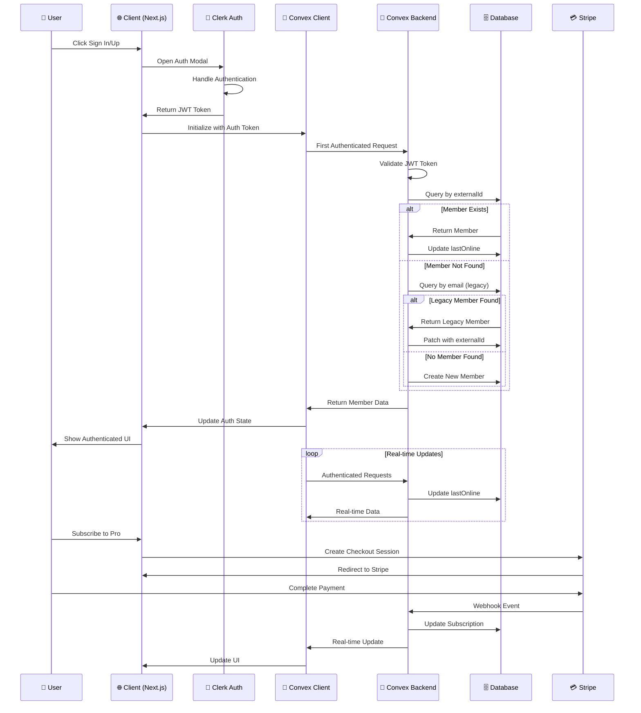

****# VAI-VEX Authentication System Documentation

## Overview

This document provides comprehensive technical documentation for the VAI-VEX authentication system, which integrates Clerk for user authentication with Convex for backend data management. This system supports both modern Clerk-based authentication and legacy email-based authentication with automatic migration.

## Table of Contents

1. [Authentication Flow Overview](#authentication-flow-overview)
2. [Schema Analysis](#schema-analysis)
3. [Hooks and State Management](#hooks-and-state-management)
4. [Webhooks and Data Synchronization](#webhooks-and-data-synchronization)
5. [JWT and Session Management](#jwt-and-session-management)
6. [Architecture Diagram](#architecture-diagram)
7. [Code Examples](#code-examples)
8. [Environment Configuration](#environment-configuration)
9. [Best Practices](#best-practices)
10. [Troubleshooting](#troubleshooting)
11. [Migration Guide](#migration-guide)
12. [Conclusion](#conclusion)

## Authentication Flow Overview

### Complete User Journey

The authentication system follows this flow:

1. **User Interaction**: User clicks sign-in/sign-up button
2. **Clerk Authentication**: Clerk handles the authentication UI and process
3. **JWT Token Generation**: Clerk generates and returns a JWT token
4. **Convex Integration**: Token is automatically passed to Convex backend
5. **Member Resolution**: Backend resolves or creates member record
6. **Session Management**: User session is maintained across the application

### Key Components

- **Clerk**: Handles authentication UI, user management, and JWT token generation
- **Convex**: Backend database and real-time synchronization
- **Next.js Middleware**: Route protection and authentication checks
- **React Hooks**: Frontend state management and authentication status

### Authentication States

The system recognizes three main authentication states:

1. **Unauthenticated**: No valid session, shows sign-in prompts
2. **Authenticated**: Valid Clerk session with member record
3. **Pending**: Valid Clerk session but member record being created/updated

## Schema Analysis

### Core Member Table

The `members` table serves as the central user data store with the following key fields:

#### Identity Fields
- `externalId`: Clerk user ID (primary identifier for new auth system)
- `email`: Email address (legacy identifier, still used for fallback)
- `firstName`, `lastName`: User's name from Clerk

#### Authentication Migration Support
- `externalId` field enables migration from legacy email-based auth
- Dual lookup strategy: first by `externalId`, then by `email`
- Automatic migration patches legacy records with `externalId`

#### Member Status and Lifecycle
- `status`: Member lifecycle state (active, cancelled, churned, free, duplicate)
- `joinedDate`: Account creation timestamp
- `lastOnline`: Real-time presence tracking
- `updatedAt`: Last profile modification

#### Subscription Integration
- `tier`: Membership level (free, scholarship, founding_member, early_bird, member)
- `subscriptionStatus`: Stripe subscription state
- `stripeCustomerId`: Links to Stripe customer records

### Related Tables

#### Subscription Management
- `subscriptions`: Stripe subscription tracking
- `payments`: Transaction history
- `stripeWebhookEvents`: Webhook processing logs

#### User-Generated Content
- `posts`: User posts linked via `memberId`
- `comments`: User comments linked via `memberId`
- `votes`: User voting activity linked via `userId`

#### Engagement Tracking
- `bookmarks`: User-saved content
- `notifications`: User notifications
- `postViews`: Analytics and view tracking

### Database Indexes

Critical indexes for authentication performance:

```typescript
.index("by_externalId", ["externalId"])     // Primary auth lookup
.index("by_email", ["email"])               // Legacy auth fallback
.index("by_stripeCustomerId", ["stripeCustomerId"]) // Payment integration
```

## Hooks and State Management

### Core Authentication Hooks

#### useCurrentMember Hook

Custom hook that provides authenticated member data:

```typescript
export function useCurrentMember() {
  const member = useQuery(api.auth.current);
  return { member, isLoading: member === undefined };
}
```

**Features:**
- Returns `null` if not authenticated
- Automatic loading states
- Real-time updates via Convex subscriptions
- Type-safe member data

#### Clerk React Hooks

The system leverages several Clerk hooks:

- `useAuth()`: Authentication state and methods
- `useUser()`: Current user data from Clerk
- `useClerk()`: Clerk instance and methods (signOut, etc.)

### Authentication Guards

#### Component-Level Guards

```typescript
import { Authenticated, Unauthenticated } from "convex/react";

// Show content only to authenticated users
<Authenticated>
  <ProtectedContent />
</Authenticated>

// Show sign-in prompts to unauthenticated users
<Unauthenticated>
  <SignInButton mode="modal" />
</Unauthenticated>
```

#### Route-Level Protection

Next.js middleware protects specific routes:

```typescript
const isProtectedRoute = createRouteMatcher(["/server"]);

export default clerkMiddleware(async (auth, req) => {
  if (isProtectedRoute(req)) await auth.protect();
});
```

### State Synchronization

The system maintains authentication state across:

1. **Clerk Session**: Browser-based session management
2. **Convex Subscriptions**: Real-time database connections
3. **React State**: Component-level authentication status
4. **Next.js Context**: Server-side authentication checks

## Webhooks and Data Synchronization

### Current Implementation

The system currently uses **lazy synchronization** rather than webhooks for user data:

#### Lazy Sync Strategy
- Member records are created/updated on first authenticated request
- `getAuthenticatedMember()` function handles automatic member creation
- Real-time presence updates (`lastOnline`) on each mutation

#### Benefits of Lazy Sync
- Simpler implementation and debugging
- No webhook endpoint security concerns
- Automatic error recovery
- Reduced infrastructure complexity

### Stripe Webhooks (Implemented)

The system does implement webhooks for payment processing:

```typescript
// Webhook endpoint: /api/stripe/webhook
export async function POST(request: Request) {
  const event = stripe.webhooks.constructEvent(body, signature, secret);
  
  await convex.mutation(api.stripe.webhooks.processWebhookEvent, {
    stripeEventId: event.id,
    type: event.type,
    data: event.data.object,
  });
}
```

**Handled Events:**
- `checkout.session.completed`: New subscription creation
- `customer.subscription.updated`: Subscription changes
- `customer.subscription.deleted`: Cancellations
- `invoice.payment_succeeded`: Payment confirmations

### Future Clerk Webhooks

The architecture supports adding Clerk webhooks for immediate user sync:

```typescript
// Potential implementation
export const upsertFromClerk = internalMutation({
  handler: async (ctx, { clerkUserId, userData }) => {
    // Immediate user data synchronization
  }
});
```

## JWT and Session Management

### JWT Token Flow

1. **Token Generation**: Clerk generates JWT tokens with user claims
2. **Token Transmission**: Automatically included in Convex requests
3. **Token Validation**: Convex validates tokens using Clerk's public keys
4. **Identity Extraction**: User identity extracted from validated token

### Convex Auth Configuration

```typescript
// convex/auth.config.ts
const authConfig = {
  providers: [
    {
      domain: process.env.CLERK_JWT_ISSUER_DOMAIN,
      applicationID: "convex",
    },
  ],
};
```

### Token Claims

Standard JWT claims used by the system:

- `sub` (subject): Clerk user ID (mapped to `externalId`)
- `email`: User's email address
- `name`: User's full name
- `iat`: Token issued at timestamp
- `exp`: Token expiration timestamp

### Session Lifecycle

#### Token Refresh
- Clerk automatically handles token refresh
- No manual refresh logic required
- Seamless user experience during token rotation

#### Session Persistence
- Sessions persist across browser restarts
- Configurable session duration in Clerk dashboard
- Automatic cleanup of expired sessions

### Security Considerations

#### Token Validation
- All tokens validated against Clerk's public keys
- Automatic signature verification
- Expiration time enforcement

#### HTTPS Enforcement
- All authentication traffic over HTTPS
- Secure cookie settings
- CSRF protection via Clerk

## Architecture Diagram

The following diagram illustrates the complete authentication flow:



## Code Examples

### Core Authentication Helper

The central authentication function that handles the unified auth flow:

<augment_code_snippet path="convex/auth.ts" mode="EXCERPT">
````typescript
export async function getAuthenticatedMember(ctx: QueryCtx | MutationCtx) {
  // Get the user identity from Clerk
  const identity = await ctx.auth.getUserIdentity();
  if (!identity) {
    throw new Error("Authentication required");
  }

  const now = Date.now();
  const externalId = identity.subject; // Clerk user ID
  const email = identity.email;

  // Check if we're in a mutation context (has patch/insert methods)
  const isMutationContext = 'patch' in ctx.db;

  // First try to find by externalId (preferred for new auth system)
  let member = await ctx.db
    .query("members")
    .withIndex("by_externalId", (q) => q.eq("externalId", externalId))
    .first();
````
</augment_code_snippet>

### React Authentication Provider

The root provider that integrates Clerk with Convex:

<augment_code_snippet path="components/ConvexClientProvider.tsx" mode="EXCERPT">
````typescript
export default function ConvexClientProvider({
  children,
}: {
  children: ReactNode;
}) {
  return (
    <ConvexProviderWithClerk client={convex} useAuth={useAuth}>
      {children}
    </ConvexProviderWithClerk>
  );
}
````
</augment_code_snippet>

### Authentication Guards in Components

Example of conditional rendering based on authentication state:

<augment_code_snippet path="components/comment-section.tsx" mode="EXCERPT">
````typescript
<Authenticated>
  <div className="mb-6">
    <EnhancedCommentInput
      placeholder="Share your thoughts..."
      onSubmit={handleSubmitComment}
      isSubmitting={isSubmitting}
    />
  </div>
</Authenticated>

<Unauthenticated>
  <div className="mb-6 p-4 bg-muted/50 rounded-lg text-center">
    <p className="text-muted-foreground mb-4">
      Join the conversation! Sign in to post comments.
    </p>
    <SignInButton mode="modal">
      <Button variant="outline">Sign In to Comment</Button>
    </SignInButton>
  </div>
</Unauthenticated>
````
</augment_code_snippet>

### Custom Authentication Hook

The useCurrentMember hook for accessing authenticated user data:

<augment_code_snippet path="hooks/use-current-member.ts" mode="EXCERPT">
````typescript
/**
 * Hook to get the current authenticated member.
 * Returns null if not authenticated.
 * Uses the unified auth system with automatic member creation/updates.
 */
export function useCurrentMember() {
  const member = useQuery(api.auth.current);
  return { member, isLoading: member === undefined };
}
````
</augment_code_snippet>

### Stripe Webhook Integration

Example of webhook processing for payment events:

<augment_code_snippet path="app/api/stripe/webhook/route.ts" mode="EXCERPT">
````typescript
export async function POST(request: Request) {
  const stripe = new Stripe(process.env.STRIPE_SECRET_KEY);
  const body = await request.text();
  const signature = headersList.get("stripe-signature");

  let event: Stripe.Event;
  try {
    event = stripe.webhooks.constructEvent(
      body,
      signature,
      process.env.STRIPE_WEBHOOK_SECRET!
    );
  } catch (err) {
    return NextResponse.json({ error: "Invalid signature" }, { status: 400 });
  }

  // Process the event in Convex
  await convex.mutation(api.stripe.webhooks.processWebhookEvent, {
    stripeEventId: event.id,
    type: event.type,
    data: event.data.object,
  });
}
````
</augment_code_snippet>

## Environment Configuration

### Required Environment Variables

The authentication system requires the following environment variables. These should be configured in your `.env.local` file for development and in your deployment environment for production. Refer to the `.env.example` file for a complete list and format.

#### Clerk Configuration
```bash
# Clerk authentication
NEXT_PUBLIC_CLERK_PUBLISHABLE_KEY=pk_test_...
CLERK_SECRET_KEY=sk_test_...
CLERK_JWT_ISSUER_DOMAIN=your-domain.clerk.accounts.dev

# Webhook endpoints (if implementing Clerk webhooks)
CLERK_WEBHOOK_SECRET=whsec_...
```

#### Convex Configuration
```bash
# Convex backend
NEXT_PUBLIC_CONVEX_URL=https://your-deployment.convex.cloud
CONVEX_DEPLOY_KEY=your-deploy-key
```

#### Stripe Integration
```bash
# Stripe payment processing
STRIPE_SECRET_KEY=sk_test_...
NEXT_PUBLIC_STRIPE_PUBLISHABLE_KEY=pk_test_...
STRIPE_WEBHOOK_SECRET=whsec_...
```

### Development Setup

1. **Install Dependencies**
   ```bash
   npm install @clerk/nextjs convex convex/react-clerk
   ```

2. **Configure Clerk**
   - Create Clerk application
   - Set up authentication providers
   - Configure JWT issuer domain

3. **Configure Convex**
   - Deploy Convex backend
   - Set up auth configuration
   - Configure environment variables

4. **Test Authentication Flow**
   - Verify sign-in/sign-up works
   - Check member creation
   - Test protected routes

## Best Practices

### Security
- Always validate JWT tokens on the backend
- Use HTTPS in production
- Implement proper CORS policies
- Regularly rotate webhook secrets

### Performance
- Use database indexes for auth lookups
- Implement proper caching strategies
- Minimize authentication checks in hot paths
- Use lazy loading for member data

### Error Handling
- Graceful degradation for auth failures
- Clear error messages for users
- Proper logging for debugging
- Fallback UI states

### Testing
- Unit tests for auth helpers
- Integration tests for auth flow
- E2E tests for complete user journey
- Mock authentication in tests

## Troubleshooting

### Common Issues

#### Member Not Found Errors
- Check JWT token validity
- Verify externalId mapping
- Ensure database indexes exist
- Check for email mismatches

#### Webhook Processing Failures
- Verify webhook signatures
- Check environment variables
- Monitor webhook logs
- Implement retry logic

#### Session Persistence Issues
- Check cookie settings
- Verify HTTPS configuration
- Review session duration settings
- Clear browser cache/cookies

### Debugging Tools

#### Clerk Dashboard
- Monitor authentication events
- Check user data
- Review session logs
- Test webhook deliveries

#### Convex Dashboard
- Monitor function calls
- Check database queries
- Review error logs
- Test mutations/queries

#### Browser DevTools
- Inspect JWT tokens
- Check network requests
- Monitor console errors
- Review local storage

## Migration Guide

### From Legacy Auth

If migrating from a legacy authentication system:

1. **Add externalId Field**
   - Update schema with externalId field
   - Create database index
   - Deploy schema changes

2. **Implement Dual Lookup**
   - Update auth helper for dual lookup
   - Test with existing users
   - Monitor migration progress

3. **Gradual Migration**
   - Existing users automatically migrated on login
   - New users use Clerk from start
   - Legacy fields maintained for compatibility

4. **Cleanup Phase**
   - Remove legacy auth code
   - Drop unused database fields
   - Update documentation

## Conclusion

The VAI-VEX authentication system provides a robust, scalable solution that combines Clerk's modern authentication capabilities with Convex's real-time backend. The lazy synchronization approach simplifies implementation while maintaining data consistency, and the dual lookup strategy enables seamless migration from legacy systems.

Key benefits:
- **Simplified Development**: Minimal boilerplate code
- **Real-time Updates**: Automatic state synchronization
- **Scalable Architecture**: Handles growth efficiently
- **Security First**: Industry-standard JWT validation
- **Migration Friendly**: Supports legacy system migration

For additional support or questions, refer to the [Clerk documentation](https://clerk.com/docs) and [Convex documentation](https://docs.convex.dev).

