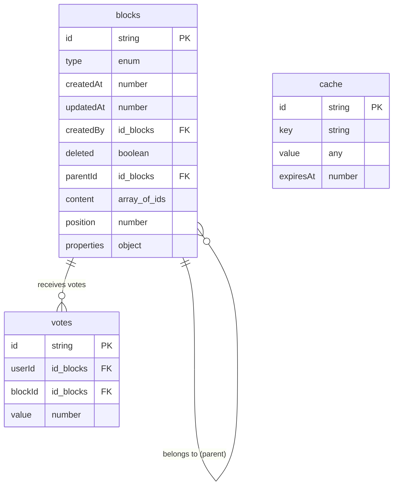
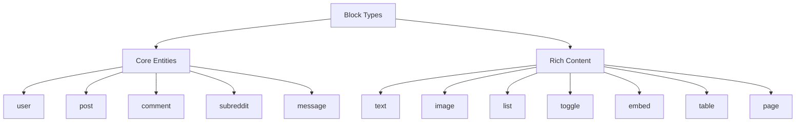
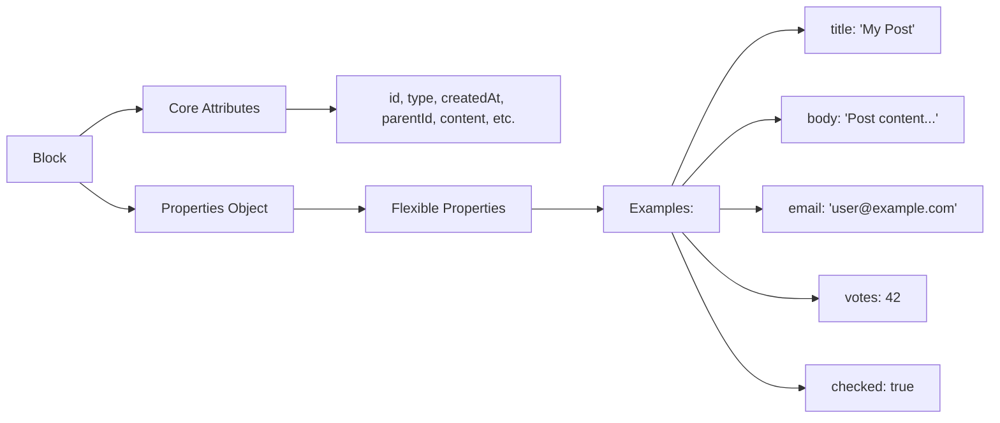
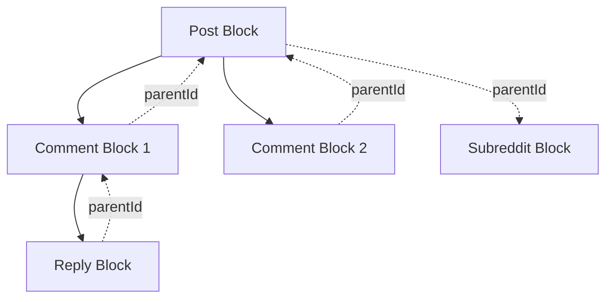
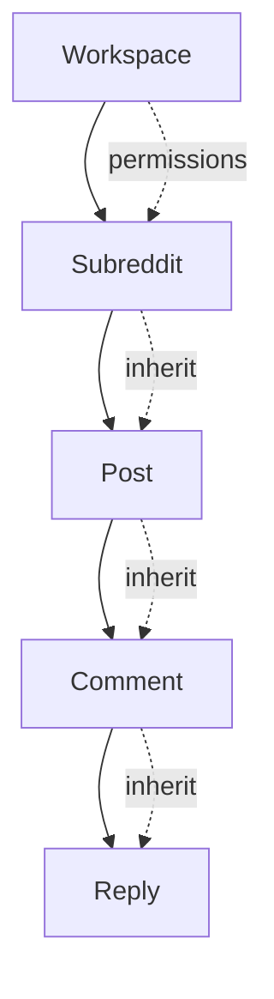

# Database Architecture: Block-Based Design

Our database follows a block-based architecture inspired by [Notion's data model](https://www.notion.com/blog/data-model-behind-notion), providing maximum flexibility for building complex features without constant schema changes.

## Core Philosophy

Everything in our system is a **block** - users, posts, comments, rich text, images, lists, and more. This atomic approach allows for:

- **Composability**: Complex structures built from simple blocks
- **Flexibility**: Transform block types while preserving data
- **Extensibility**: Add new features without schema migrations
- **Consistency**: Unified approach to all data types

## Schema Overview



## Block Structure

Every block has these core attributes:

### Identity & Metadata
- **id**: Unique identifier (UUID)
- **type**: Defines how the block renders and behaves
- **createdAt/updatedAt**: Timestamps
- **createdBy**: Reference to user block who created it
- **deleted**: Soft delete flag

### Hierarchy & Composition
- **parentId**: Parent block for permissions inheritance (upward pointer)
- **content**: Array of child block IDs for rich composition (downward pointers)
- **position**: Order within parent's content array

### Social Features
- **votes**: Aggregate vote score (upvotes - downvotes)

## Block Types



## Data Storage Pattern

Following Notion's approach, we store block properties directly on the block as a flexible object:



## Hierarchy Examples

### Simple Post with Comments



### Rich Content Post

```mermaid
graph TD
    A[Post Block] --> B[Text Block: "Introduction"]
    A --> C[Image Block]
    A --> D[List Block]
    A --> E[Text Block: "Conclusion"]
    
    D --> F[List Item 1]
    D --> G[List Item 2]
    D --> H[List Item 3]
    
    A -.->|parentId| I[Subreddit Block]
```

## Key Benefits

### 1. Type Flexibility
Blocks can transform between types while preserving data:

```typescript
// Transform a comment into a post
await ctx.db.patch(commentId, { type: "post" });
// All properties (title, body, etc.) are preserved in data table
```

### 2. Rich Composition
Build complex structures from simple blocks:

```typescript
// A post containing text, image, and nested comments
const post = {
  type: "post",
  content: [textBlockId, imageBlockId, commentBlockId],
  // ... other attributes
};
```

### 3. Permissions Inheritance
Permissions flow down the parent chain:



### 4. Easy Extensions
Add new block types without schema changes:

```typescript
// Add new block types to the union
const blockTypes = v.union(
  // ... existing types
  v.literal("poll"),      // New: voting polls
  v.literal("calendar"),  // New: calendar events
  v.literal("kanban")     // New: kanban boards
);
```

## Query Patterns

### Get Block with Properties
```typescript
const block = await ctx.db.get(blockId);
// Properties are directly on the block object
const title = block.properties.title;
const body = block.properties.body;
```

### Get Block Hierarchy
```typescript
const children = await ctx.db
  .query("blocks")
  .withIndex("parentId", q => q.eq("parentId", blockId))
  .order("position")
  .collect();
```

### Transform Block Type
```typescript
await ctx.db.patch(blockId, { type: "newType" });
// Properties automatically preserved in properties object
```

### Search by Properties
```typescript
// Find posts by title
const posts = await ctx.db
  .query("blocks")
  .withIndex("title", q => q.eq("properties.title", "My Post"))
  .collect();

// Find users by username
const user = await ctx.db
  .query("blocks")
  .withIndex("username", q => q.eq("properties.username", "john"))
  .first();
```

## Migration Strategy

When migrating from the old schema:

1. **Remove data table**: Move all key-value pairs into `properties` object on blocks
2. **Rename tables**: `things` → `blocks`, update all references  
3. **Add new fields**: `content: []`, `position: 0`, `properties: {}` for existing records
4. **Update indexes**: Add position indexes and property-specific indexes
5. **Migrate queries**: Update all database queries to use new table and property structure

This block-based architecture gives us the flexibility to build rich, composable features while maintaining a clean, consistent data model that can evolve with our needs.